Review on relationship between three factors, GDP (PPP) per capita,
Religiosity and Fertility
================
2023-05-11

# Analysis and Visualisation for the PSY6422 module project

## Background

Vandenbroucke (2016) claimed that there is generally an inverse
correlation between income and the total fertility rate within and
between nations. Higher income allows people to have an access to the
higher the degree of education. It was found that fewer children are
born in any developed country. According Rowthorn (2011), the married
women who share the same religion with her spouse tend to have more
babies, and less likely to not produce any. Also, Storm (2017) found
that lower income is associated with more religiosity, a negative
relationship. In this analysis I wanted to confirm if their claim is to
be true. Thus following three hypotheses were formulated.

### Hypotheses:

1: Countries with greater PPP per capita would show lower fertility
rate.

2: Countries with greater religiosity would show greater fertility rate.

3: Countries with greater PPP per capita would be less religious.

### Methods

## Data collection

For ‘PPP per capita’, International Monetary Fund (IMF) data from
Statistics Times (2021)is used for the analysis. For ‘fertility rate’,
Dataset for World Population Review (2023) is used for analysis.

## Analysis

``` r
#libraries
library(conflicted)
```

    ## Warning: package 'conflicted' was built under R version 4.2.3

``` r
library(tidyverse)
```

    ## Warning: package 'tidyverse' was built under R version 4.2.3

    ## Warning: package 'ggplot2' was built under R version 4.2.3

    ## Warning: package 'tibble' was built under R version 4.2.3

    ## Warning: package 'dplyr' was built under R version 4.2.3

    ## ── Attaching core tidyverse packages ──────────────────────── tidyverse 2.0.0 ──
    ## ✔ dplyr     1.1.2     ✔ readr     2.1.4
    ## ✔ forcats   1.0.0     ✔ stringr   1.5.0
    ## ✔ ggplot2   3.4.2     ✔ tibble    3.2.1
    ## ✔ lubridate 1.9.2     ✔ tidyr     1.3.0
    ## ✔ purrr     1.0.1

``` r
conflict_prefer("filter", "dplyr")
```

    ## [conflicted] Will prefer dplyr::filter over any other package.

``` r
conflict_prefer("lag", "dplyr")
```

    ## [conflicted] Will prefer dplyr::lag over any other package.

``` r
library(readxl) # Load the readxl package; data is excel file
```

    ## Warning: package 'readxl' was built under R version 4.2.3

``` r
library(ggplot2)
library(ggrepel)
```

    ## Warning: package 'ggrepel' was built under R version 4.2.3

``` r
library(gganimate)
```

    ## Warning: package 'gganimate' was built under R version 4.2.3

``` r
#library(ggrepel) for naming the dots in regional scatter?

# Set the working directory to the folder 'kinu1004.github.io'
setwd("C:/Users/kinu1/Documents/kinu1004.github.io")

# Import the data using the read_excel function
data <- read_excel("data/Fertility_data.xlsx")

# Remove rows with missing values
df<- data[complete.cases(data), ]

# Rename the variables
colnames(df) <- c("Country", "PPP", "Religiosity", "Fertility", "Region")
```

## Scatterplots

### The Gengeral relationship between PPP per capita and Fertility rate

``` r
ggplot(df, aes(x = PPP, y = Fertility, color = Fertility)) +
  geom_point() +
  labs(x = "PPP per capita (in USD)", y = "Fertility rate", title = "Relationship between PPP per capita (in USD) \nand Fertility rate", caption = "Data Source: Statistics Times and World Population Review") +
  scale_color_viridis_c(option = "magma") +
  geom_smooth(method = "lm", se = FALSE, color = "black") +
  theme_classic() +
  theme(
    plot.title = element_text(size = 16, face = "bold", hjust = 0.5),
    axis.title = element_text(size = 12, face = "bold"),
    axis.text = element_text(size = 10))
```

    ## `geom_smooth()` using formula = 'y ~ x'

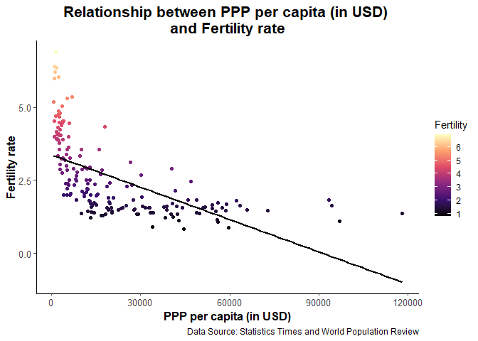<!-- -->

``` r
## Animation
df_sorted1 <- df[order(df$PPP), ] #sort data by PPP

# Initial plot object setting
p1 <- ggplot(df_sorted1, aes(x = PPP, y = Fertility, color = Fertility)) +
  geom_point() +
  labs(x = "PPP per Capita (in USD)", y = "Fertility rate", 
       title = "Relationship between PPP per Capita (in USD) \nand Fertility rate", 
       caption = "Data Source: Statistics Times and World Population Review") +
  scale_color_viridis_c(option = "magma") +
  theme_classic() +
  theme(
    plot.title = element_text(size = 16, face = "bold", hjust = 0.5),
    axis.title = element_text(size = 12, face = "bold"),
    axis.text = element_text(size = 10))

# Animate the plot
animated_plot1 <- p1 + transition_manual(PPP, cumulative = TRUE) +
  enter_grow()

# Preview the animation
animate(animated_plot1)
```

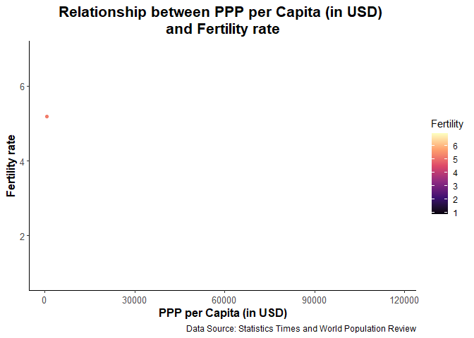<!-- -->

The general relationship between fertility rate and PPP show a negative
correlation. Therefore, hypothesis 1 is supported here.

### Regional difference in the relationship

### Africa

``` r
# Subset the dataframe to include only Africa data
df_africa <- subset(df, Region == "Africa")

ggplot(df_africa, aes(x = PPP, y = Fertility, color = Fertility)) +
  geom_point() +
  labs(x = "PPP per capita (in USD)", y = "Fertility rate", title = "Relationship between PPP per capita (in USD) \nand Fertility rate in Africa", caption = "Data Source: Statistics Times and World Population Review") +
  scale_color_viridis_c(option = "magma") +
  geom_text_repel(aes(label = ifelse(!is.na(Country), Country, "")), size = 3, color = "black", show.legend = FALSE) +
  geom_smooth(method = "lm", se = FALSE, color = "black", linewidth = 0.5) +
  theme_classic() +
  theme(
    plot.title = element_text(size = 16, face = "bold", hjust = 0.5),
    axis.title = element_text(size = 12, face = "bold"),
    axis.text = element_text(size = 10),
    plot.caption = element_text(size = 10, color = "gray"))
```

    ## `geom_smooth()` using formula = 'y ~ x'

    ## Warning: ggrepel: 22 unlabeled data points (too many overlaps). Consider
    ## increasing max.overlaps

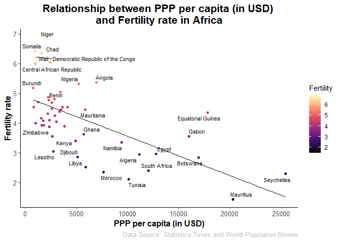<!-- -->

African fertility rate and PPP show a negative correlation.

### Asia

``` r
# Subset the dataframe to include only Asia data
df_asia <- subset(df, Region == "Asia")

ggplot(df_asia, aes(x = PPP, y = Fertility, color = Fertility)) +
  geom_point() +
  labs(x = "PPP per capita (in USD)", y = "Fertility rate", title = "Relationship between PPP per capita (in USD) \nand Fertility rate in Asia", caption = "Data Source: Statistics Times and World Population Review") +
  scale_color_viridis_c(option = "magma") +
  geom_text_repel(aes(label = ifelse(!is.na(Country), Country, "")), size = 3, color = "black", show.legend = FALSE) +
  geom_smooth(method = "lm", se = FALSE, color = "black", linewidth = 0.5) +
  theme_classic() +
  theme(
    plot.title = element_text(size = 16, face = "bold", hjust = 0.5),
    axis.title = element_text(size = 12, face = "bold"),
    axis.text = element_text(size = 10),
    plot.caption = element_text(size = 10, color = "gray"))
```

    ## `geom_smooth()` using formula = 'y ~ x'

    ## Warning: ggrepel: 1 unlabeled data points (too many overlaps). Consider
    ## increasing max.overlaps

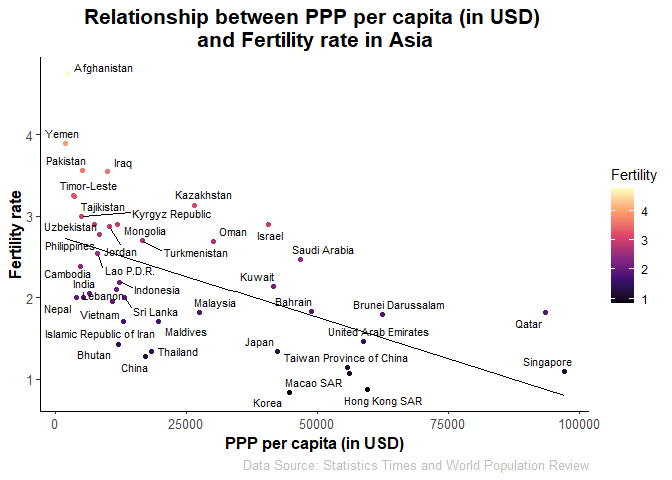<!-- -->

Asian fertility rate and PPP show a negative correlation.

## Europe

``` r
# Subset the dataframe to include only Europe data
df_europe <- subset(df, Region == "Europe")

ggplot(df_europe, aes(x = PPP, y = Fertility, color = Fertility)) +
  geom_point() +
  labs(x = "PPP per capita (in USD)", y = "Fertility rate", title = "Relationship between PPP per capita (in USD) \nand Fertility rate in Europe", caption = "Data Source: Statistics Times and World Population Review") +
  scale_color_viridis_c(option = "magma") +
  geom_text_repel(aes(label = ifelse(!is.na(Country), Country, "")), size = 3, color = "black", show.legend = FALSE) +
  geom_smooth(method = "lm", se = FALSE, color = "black", linewidth = 0.5) +
  theme_classic() +
  theme(
    plot.title = element_text(size = 16, face = "bold", hjust = 0.5),
    axis.title = element_text(size = 12, face = "bold"),
    axis.text = element_text(size = 10),
    plot.caption = element_text(size = 10, color = "gray"))
```

    ## `geom_smooth()` using formula = 'y ~ x'

    ## Warning: ggrepel: 3 unlabeled data points (too many overlaps). Consider
    ## increasing max.overlaps

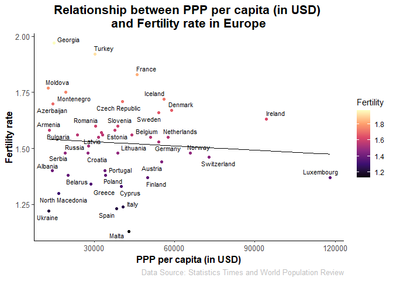<!-- -->

European fertility rate and PPP show a slightly negative correlation.

### Oceania

``` r
# Subset the dataframe to include only Oceania data
df_oceania <- subset(df, Region == "Oceania")

ggplot(df_oceania, aes(x = PPP, y = Fertility, color = Fertility)) +
  geom_point() +
  labs(x = "PPP per capita (in USD)", y = "Fertility rate", title = "Relationship between PPP per capita (in USD) \nand Fertility rate in Oceania", caption = "Data Source: Statistics Times and World Population Review") +
  scale_color_viridis_c(option = "magma") +
  geom_text_repel(aes(label = ifelse(!is.na(Country), Country, "")), size = 3, color = "black", show.legend = FALSE) +
  geom_smooth(method = "lm", se = FALSE, color = "black", linewidth = 0.5) +
  theme_classic() +
  theme(
    plot.title = element_text(size = 16, face = "bold", hjust = 0.5),
    axis.title = element_text(size = 12, face = "bold"),
    axis.text = element_text(size = 10),
    plot.caption = element_text(size = 10, color = "gray"))
```

    ## `geom_smooth()` using formula = 'y ~ x'

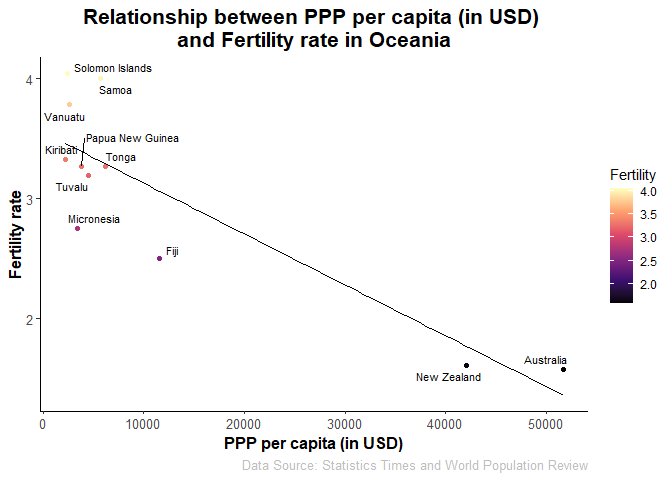<!-- -->

The relationship of the variables is found negative. Although there are
two countries, New zealand and Australia that seem to pulling the
best-fit line, the correlation would still be slightly negative looking
at the pattern of other countries.

### North America

``` r
# Subset the dataframe to include only North America data
df_northa <- subset(df, Region == "North America")

ggplot(df_northa, aes(x = PPP, y = Fertility, color = Fertility)) +
  geom_point() +
  labs(x = "PPP per capita (in USD)", y = "Fertility rate", title = "Relationship between PPP per capita (in USD) \nand Fertility rate in North America", caption = "Data Source: Statistics Times and World Population Review") +
  scale_color_viridis_c(option = "magma") +
  geom_text_repel(aes(label = ifelse(!is.na(Country), Country, "")), size = 3, color = "black", show.legend = FALSE) +
  geom_smooth(method = "lm", se = FALSE, color = "black", linewidth = 0.5) +
  theme_classic() +
  theme(
    plot.title = element_text(size = 16, face = "bold", hjust = 0.5),
    axis.title = element_text(size = 12, face = "bold"),
    axis.text = element_text(size = 10),
    plot.caption = element_text(size = 10, color = "gray"))
```

    ## `geom_smooth()` using formula = 'y ~ x'

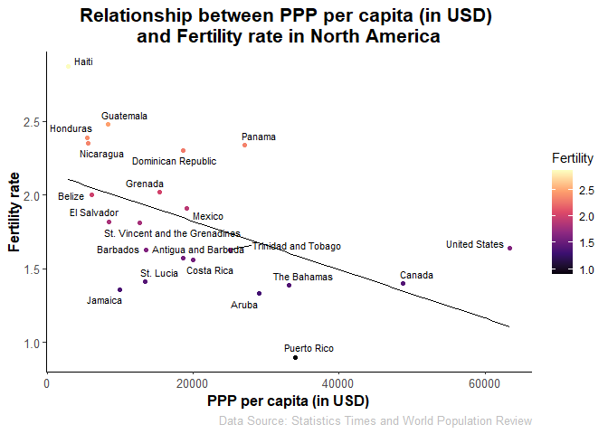<!-- -->

The relationship between fertility rate and PPP of North American
countries is found negative.

### South America

``` r
# Subset the dataframe to include only South America data
df_southa <- subset(df, Region == "South America")

ggplot(df_southa, aes(x = PPP, y = Fertility, color = Fertility)) +
  geom_point() +
  labs(x = "PPP per capita (in USD)", y = "Fertility rate", title = "Relationship between PPP per capita (in USD) \nand Fertility rate in South America", caption = "Data Source: Statistics Times and World Population Review") +
  scale_color_viridis_c(option = "magma") +
  geom_text_repel(aes(label = ifelse(!is.na(Country), Country, "")), size = 3, color = "black", show.legend = FALSE) +
  geom_smooth(method = "lm", se = FALSE, color = "black", linewidth = 0.5) +
  theme_classic() +
  theme(
    plot.title = element_text(size = 16, face = "bold", hjust = 0.5),
    axis.title = element_text(size = 12, face = "bold"),
    axis.text = element_text(size = 10),
    plot.caption = element_text(size = 10, color = "gray"))
```

    ## `geom_smooth()` using formula = 'y ~ x'

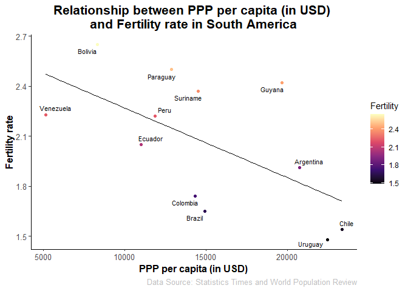<!-- -->

The relationship between two variables found negative in South American
countries.

### The general relationship regarding regional differences

``` r
ggplot(df, aes(x = PPP, y = Fertility, color = Region)) +
  geom_point(size = 3) +
  labs(x = "PPP per capita (in USD)", y = "Fertility", 
       title = "Relationship between PPP per capita (in USD)\nand Fertility rate by region", caption = "Data Source: Statistics Times and World Population Review") +
  scale_color_manual(values = c("red", "blue", "green", "purple", "orange", "#FFD700")) +
  geom_smooth(method = "lm", se = FALSE, aes(group = Region, color = Region)) +
  theme_minimal() +
  theme(
    plot.title = element_text(size = 16, face = "bold", hjust = 0.5, lineheight = 1.2),
    axis.title = element_text(size = 12, face = "bold"),
    axis.text = element_text(size = 10),
    legend.position = "bottom")
```

    ## `geom_smooth()` using formula = 'y ~ x'

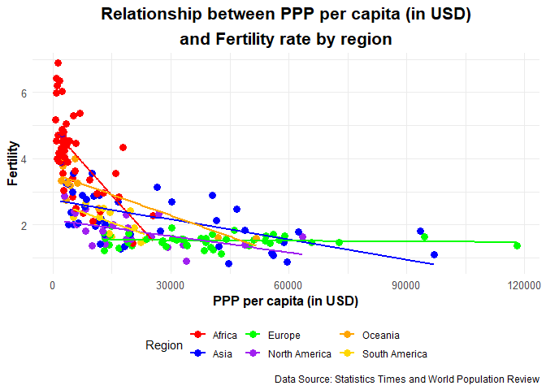<!-- -->

According to the scatter plot above, the six regions all demostrated
negative association between PPP per capita and religiosity. However,
the strength of them were not similar. Region of country seems to have
an effect on the correlations.

### The Gengeral relationship between Religiosity and Fertility rate

``` r
ggplot(df, aes(x = Religiosity, y = Fertility, color = Fertility)) +
  geom_point() +
  labs(x = "Religiosity", y = "Fertility rate", title = "Relationship between Religiosity \nand Fertility rate", caption = "Data Source: Statistics Times and World Population Review") +
  scale_color_viridis_c(option = "magma") +
  geom_smooth(method = "lm", se = FALSE, color = "black") +
  theme_classic() +
  theme(
    plot.title = element_text(size = 16, face = "bold", hjust = 0.5),
    axis.title = element_text(size = 12, face = "bold"),
    axis.text = element_text(size = 10))
```

    ## `geom_smooth()` using formula = 'y ~ x'

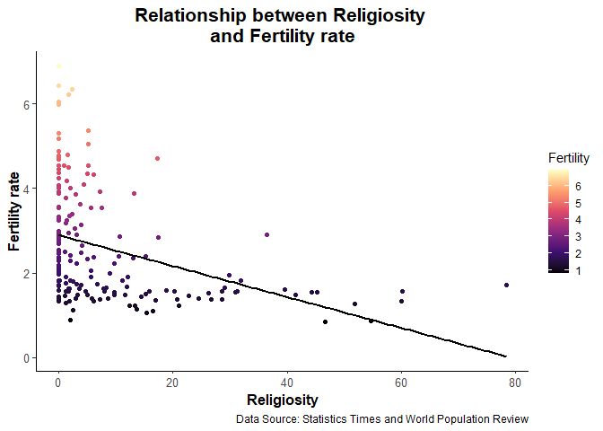<!-- -->

``` r
## Animation
# Sort the data by Religiosity
df_sorted2 <- df[order(df$Religiosity), ]

# Create the initial plot object
p2 <- ggplot() +
  geom_point(data = df_sorted2, aes(x = Religiosity, y = Fertility, color = Fertility)) +
  labs(x = "Religiosity", y = "Fertility rate", 
       title = "Relationship between Religiosity \nand Fertility rate", 
       caption = "Data Source: Statistics Times and World Population Review") +
  scale_color_viridis_c(option = "magma") +
  theme_classic() +
  theme(
    plot.title = element_text(size = 16, face = "bold", hjust = 0.5),
    axis.title = element_text(size = 12, face = "bold"),
    axis.text = element_text(size = 10))

# Animate the plot
animated_plot2 <- p2 + transition_manual(Religiosity, cumulative = TRUE) +
  enter_grow()

# Preview the animation
animate(animated_plot2)
```

    ## nframes and fps adjusted to match transition

<!-- -->

Unlike the initial assumption, more religious countries did not show
greater fertility rate. It turned out rather opposite. The hypothesis 2
that religious countries would have more babies, is rejected.

### Regional difference in the relationship

### Africa

``` r
# Subset the dataframe to include only Africa data
df_africa <- subset(df, Region == "Africa")

ggplot(df_africa, aes(x = Religiosity, y = Fertility, color = Fertility)) +
  geom_point() +
  labs(x = "Religiosity", y = "Fertility rate", title = "Relationship between Religiosity \nand Fertility rate in Africa", caption = "Data Source: Statistics Times and World Population Review") +
  scale_color_viridis_c(option = "magma") +
  geom_text_repel(aes(label = ifelse(!is.na(Country), Country, "")), size = 3, color = "black", show.legend = FALSE) +
  geom_smooth(method = "lm", se = FALSE, color = "black", linewidth = 0.5) +
  theme_classic() +
  theme(
    plot.title = element_text(size = 16, face = "bold", hjust = 0.5),
    axis.title = element_text(size = 12, face = "bold"),
    axis.text = element_text(size = 10),
    plot.caption = element_text(size = 10, color = "gray"))
```

    ## `geom_smooth()` using formula = 'y ~ x'

    ## Warning: ggrepel: 6 unlabeled data points (too many overlaps). Consider
    ## increasing max.overlaps

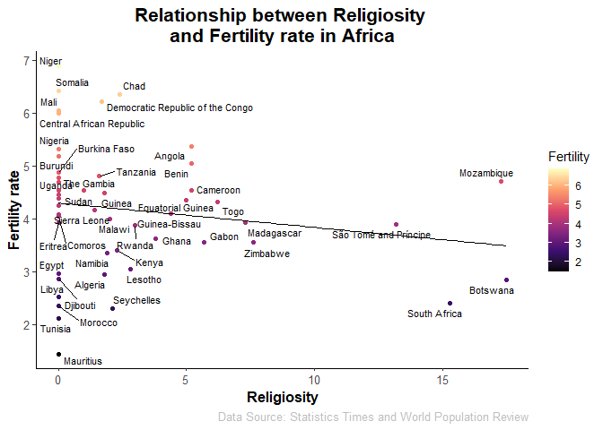<!-- -->

African fertility rate and religiosity show a negative correlation.

### Asia

``` r
# Subset the dataframe to include only Asia data
df_asia <- subset(df, Region == "Asia")

ggplot(df_asia, aes(x = Religiosity, y = Fertility, color = Fertility)) +
  geom_point() +
  labs(x = "Religiosity", y = "Fertility rate", title = "Relationship between Religiosity \nand Fertility rate in Asia", caption = "Data Source: Statistics Times and World Population Review") +
  scale_color_viridis_c(option = "magma") +
  geom_text_repel(aes(label = ifelse(!is.na(Country), Country, "")), size = 3, color = "black", show.legend = FALSE) +
  geom_smooth(method = "lm", se = FALSE, color = "black", linewidth = 0.5) +
  theme_classic() +
  theme(
    plot.title = element_text(size = 16, face = "bold", hjust = 0.5),
    axis.title = element_text(size = 12, face = "bold"),
    axis.text = element_text(size = 10),
    plot.caption = element_text(size = 10, color = "gray"))
```

    ## `geom_smooth()` using formula = 'y ~ x'

    ## Warning: ggrepel: 13 unlabeled data points (too many overlaps). Consider
    ## increasing max.overlaps

<!-- -->

Asian fertility rate and religiosity show a negative correlation.

## Europe

``` r
# Subset the dataframe to include only Europe data
df_europe <- subset(df, Region == "Europe")

ggplot(df_europe, aes(x = Religiosity, y = Fertility, color = Fertility)) +
  geom_point() +
  labs(x = "Religiosity", y = "Fertility rate", title = "Relationship between Religiosity \nand Fertility rate in Europe", caption = "Data Source: Statistics Times and World Population Review") +
  scale_color_viridis_c(option = "magma") +
  geom_text_repel(aes(label = ifelse(!is.na(Country), Country, "")), size = 3, color = "black", show.legend = FALSE) +
  geom_smooth(method = "lm", se = FALSE, color = "black", linewidth = 0.5) +
  theme_classic() +
  theme(
    plot.title = element_text(size = 16, face = "bold", hjust = 0.5),
    axis.title = element_text(size = 12, face = "bold"),
    axis.text = element_text(size = 10),
    plot.caption = element_text(size = 10, color = "gray"))
```

    ## `geom_smooth()` using formula = 'y ~ x'

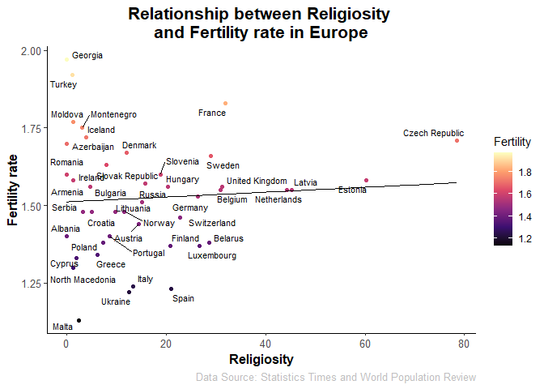<!-- -->

Unlike Africa and Asia, European fertility rate and religiosity had a
slightly positive correlation.

### Oceania

``` r
# Subset the dataframe to include only Oceania data
df_oceania <- subset(df, Region == "Oceania")

ggplot(df_oceania, aes(x = Religiosity, y = Fertility, color = Fertility)) +
  geom_point() +
  labs(x = "Religiosity", y = "Fertility rate", title = "Relationship between Religiosity \nand Fertility rate in Oceania", caption = "Data Source: Statistics Times and World Population Review") +
  scale_color_viridis_c(option = "magma") +
  geom_text_repel(aes(label = ifelse(!is.na(Country), Country, "")), size = 3, color = "black", show.legend = FALSE) +
  geom_smooth(method = "lm", se = FALSE, color = "black", linewidth = 0.5) +
  theme_classic() +
  theme(
    plot.title = element_text(size = 16, face = "bold", hjust = 0.5),
    axis.title = element_text(size = 12, face = "bold"),
    axis.text = element_text(size = 10),
    plot.caption = element_text(size = 10, color = "gray"))
```

    ## `geom_smooth()` using formula = 'y ~ x'

<!-- -->

Again, fertility rate and religiosity of Oceanic countries is negatively
correlated.

### North America

``` r
# Subset the dataframe to include only North America data
df_northa <- subset(df, Region == "North America")

ggplot(df_northa, aes(x = Religiosity, y = Fertility, color = Fertility)) +
  geom_point() +
  labs(x = "Religiosity", y = "Fertility rate", title = "Relationship between Religiosity \nand Fertility rate in North America", caption = "Data Source: Statistics Times and World Population Review") +
  scale_color_viridis_c(option = "magma") +
  geom_text_repel(aes(label = ifelse(!is.na(Country), Country, "")), size = 3, color = "black", show.legend = FALSE) +
  geom_smooth(method = "lm", se = FALSE, color = "black", linewidth = 0.5) +
  theme_classic() +
  theme(
    plot.title = element_text(size = 16, face = "bold", hjust = 0.5),
    axis.title = element_text(size = 12, face = "bold"),
    axis.text = element_text(size = 10),
    plot.caption = element_text(size = 10, color = "gray"))
```

    ## `geom_smooth()` using formula = 'y ~ x'

<!-- -->

The relationship between fertility rate and religiosity of North
American countries is found slightly positive like Europe.

### South America

``` r
# Subset the dataframe to include only South America data
df_southa <- subset(df, Region == "South America")

ggplot(df_southa, aes(x = Religiosity, y = Fertility, color = Fertility)) +
  geom_point() +
  labs(x = "Religiosity", y = "Fertility rate", title = "Relationship between Religiosity \nand Fertility rate in South America", caption = "Data Source: Statistics Times and World Population Review") +
  scale_color_viridis_c(option = "magma") +
  geom_text_repel(aes(label = ifelse(!is.na(Country), Country, "")), size = 3, color = "black", show.legend = FALSE) +
  geom_smooth(method = "lm", se = FALSE, color = "black", linewidth = 0.5) +
  theme_classic() +
  theme(
    plot.title = element_text(size = 16, face = "bold", hjust = 0.5),
    axis.title = element_text(size = 12, face = "bold"),
    axis.text = element_text(size = 10),
    plot.caption = element_text(size = 10, color = "gray"))
```

    ## `geom_smooth()` using formula = 'y ~ x'

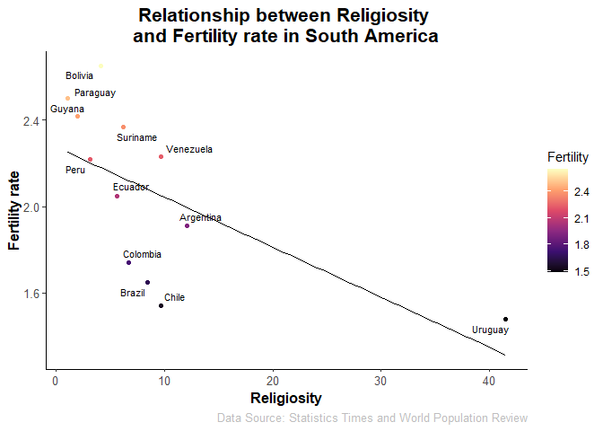<!-- -->

The relationship between the two variables found negative in South
American countries.

### The general relationship regarding regional differences

``` r
ggplot(df, aes(x = Religiosity, y = Fertility, color = Region)) +
  geom_point() +
  labs(x = "Religiosity", y = "Fertility", title = "Relationship between Religiosity \nand Fertility", caption = "Data Source: Statistics Times and World Population Review") +
  scale_color_manual(values = c("red", "blue", "green", "purple", "orange", "#FFD700")) +
  geom_smooth(method = "lm", se = FALSE, aes(group = Region, color = Region)) +
  theme_minimal() +
  theme(
    plot.title = element_text(size = 16, face = "bold", hjust = 0.5, lineheight = 1.2),
    axis.title = element_text(size = 12, face = "bold"),
    axis.text = element_text(size = 10),
    legend.position = "bottom")
```

    ## `geom_smooth()` using formula = 'y ~ x'

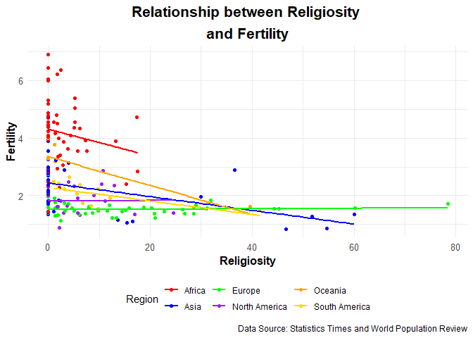<!-- -->

The scatterplots demonstrate more negative-like correlations between
religiosity and fertility rate. Two of six regions, Europe and North
America showed weak but positive relationship interestingly. Religiosity
does not seem to be strong predictor of fertility rate compared to PPP
per capita.

### The Gengeral relationship between PPP per capita and Religiosity

``` r
ggplot(df, aes(x = PPP, y = Religiosity, color = Religiosity)) +
  geom_point() +
  labs(x = "PPP per capita (in USD)", y = "Religiosity", title = "Relationship between PPP per capita (in USD) \nand Religiosity", caption = "Data Source: Statistics Times and World Population Review") +
  scale_color_viridis_c(option = "magma") +
  geom_smooth(method = "lm", se = FALSE, color = "black") +
  theme_classic() +
  theme(
    plot.title = element_text(size = 16, face = "bold", hjust = 0.5),
    axis.title = element_text(size = 12, face = "bold"),
    axis.text = element_text(size = 10))
```

    ## `geom_smooth()` using formula = 'y ~ x'

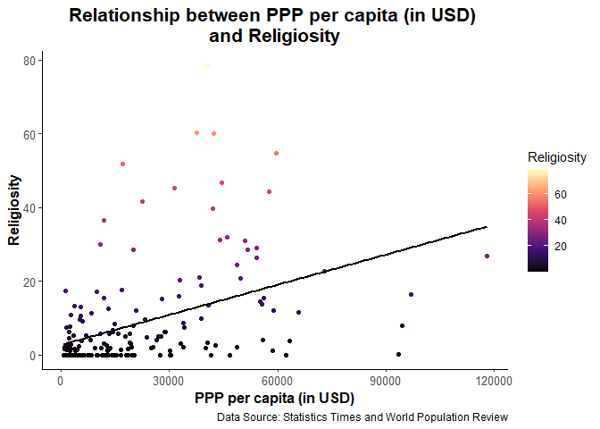<!-- -->

``` r
## Animation
# Sort the data by Religiosity
df_sorted1 <- df[order(df$PPP), ]

# Create the initial plot object
p3 <- ggplot() +
  geom_point(data = df_sorted1, aes(x = PPP, y = Religiosity, color = Religiosity)) +
  labs(x = "PPP per Capita (in USD)", y = "Religiosity", 
       title = "Relationship between PPP per Capita \nand Religiosity", 
       caption = "Data Source: Statistics Times and World Population Review") +
  scale_color_viridis_c(option = "magma") +
  theme_classic() +
  theme(
    plot.title = element_text(size = 16, face = "bold", hjust = 0.5),
    axis.title = element_text(size = 12, face = "bold"),
    axis.text = element_text(size = 10))

# Animate the plot
animated_plot3 <- p3 + transition_manual(PPP, cumulative = TRUE) +
  enter_grow()

# Preview the animation
animate(animated_plot3)
```

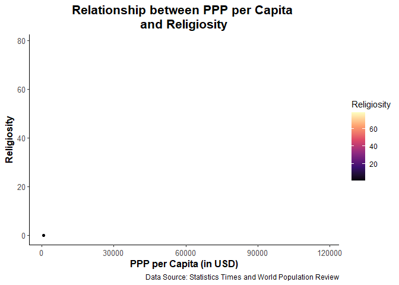<!-- -->

Again, hypothesis 3, expecting a negative relationship between PPP per
capita and religiosity, is rejected.

### Regional difference in the relationship

### Africa

``` r
# Subset the dataframe to include only Africa data
df_africa <- subset(df, Region == "Africa")

ggplot(df_africa, aes(x = PPP, y = Religiosity, color = Religiosity)) +
  geom_point() +
  labs(x = "PPP per capita (in USD)", y = "Religiosity", title = "Relationship between PPP per capita (in USD) \nand Religiosity in Africa", caption = "Data Source: Statistics Times and World Population Review") +
  scale_color_viridis_c(option = "magma") +
  geom_text_repel(aes(label = ifelse(!is.na(Country), Country, "")), size = 3, color = "black", show.legend = FALSE) +
  geom_smooth(method = "lm", se = FALSE, color = "black", linewidth = 0.5) +
  theme_classic() +
  theme(
    plot.title = element_text(size = 16, face = "bold", hjust = 0.5),
    axis.title = element_text(size = 12, face = "bold"),
    axis.text = element_text(size = 10),
    plot.caption = element_text(size = 10, color = "gray"))
```

    ## `geom_smooth()` using formula = 'y ~ x'

    ## Warning: ggrepel: 20 unlabeled data points (too many overlaps). Consider
    ## increasing max.overlaps

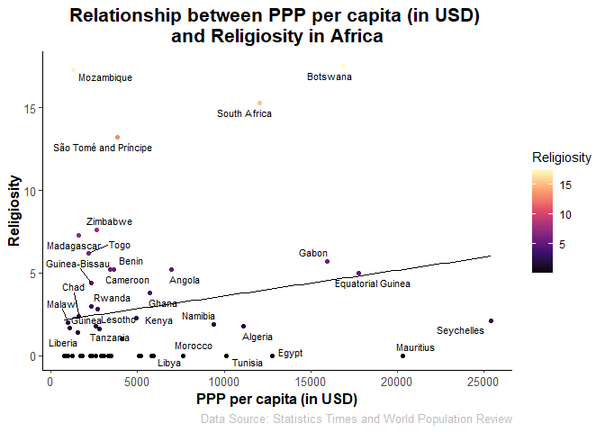<!-- -->

African fertility rate and religiosity show a positive correlation.

### Asia

``` r
# Subset the dataframe to include only Asia data
df_asia <- subset(df, Region == "Asia")

ggplot(df_asia, aes(x = PPP, y = Religiosity, color = Religiosity)) +
  geom_point() +
  labs(x = "PPP per capita (in USD)", y = "Religiosity", title = "Relationship between PPP per capita (in USD) \nand Religiosity in Asia", caption = "Data Source: Statistics Times and World Population Review") +
  scale_color_viridis_c(option = "magma") +
  geom_text_repel(aes(label = ifelse(!is.na(Country), Country, "")), size = 3, color = "black", show.legend = FALSE) +
  geom_smooth(method = "lm", se = FALSE, color = "black", linewidth = 0.5) +
  theme_classic() +
  theme(
    plot.title = element_text(size = 16, face = "bold", hjust = 0.5),
    axis.title = element_text(size = 12, face = "bold"),
    axis.text = element_text(size = 10),
    plot.caption = element_text(size = 10, color = "gray"))
```

    ## `geom_smooth()` using formula = 'y ~ x'

    ## Warning: ggrepel: 23 unlabeled data points (too many overlaps). Consider
    ## increasing max.overlaps

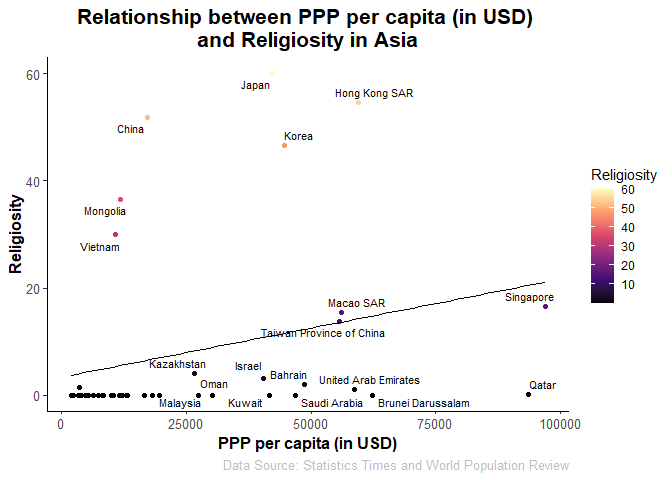<!-- -->

The relationship was observed to be positive for Asian countries.
Although it seems there are number of outliers only looking at Asian
countries, it would still show positive relationship even if they are
removed.

## Europe

``` r
# Subset the dataframe to include only Europe data
df_europe <- subset(df, Region == "Europe")

ggplot(df_europe, aes(x = PPP, y = Religiosity, color = Religiosity)) +
  geom_point() +
  labs(x = "PPP per capita (in USD)", y = "Religiosity", title = "Relationship between PPP per capita (in USD) \nand Religiosity in Europe", caption = "Data Source: Statistics Times and World Population Review") +
  scale_color_viridis_c(option = "magma") +
  geom_text_repel(aes(label = ifelse(!is.na(Country), Country, "")), size = 3, color = "black", show.legend = FALSE) +
  geom_smooth(method = "lm", se = FALSE, color = "black", linewidth = 0.5) +
  theme_classic() +
  theme(
    plot.title = element_text(size = 16, face = "bold", hjust = 0.5),
    axis.title = element_text(size = 12, face = "bold"),
    axis.text = element_text(size = 10),
    plot.caption = element_text(size = 10, color = "gray"))
```

    ## `geom_smooth()` using formula = 'y ~ x'

    ## Warning: ggrepel: 11 unlabeled data points (too many overlaps). Consider
    ## increasing max.overlaps

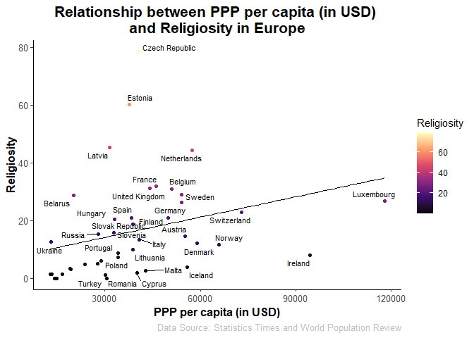<!-- -->

European PPP and religiosity show a positive correlation.

### Oceania

``` r
# Subset the dataframe to include only Oceania data
df_oceania <- subset(df, Region == "Oceania")

ggplot(df_oceania, aes(x = PPP, y = Religiosity, color = Religiosity)) +
  geom_point() +
  labs(x = "PPP per capita (in USD)", y = "Religiosity", title = "Relationship between PPP per capita (in USD) \nand Religiosity in Oceania", caption = "Data Source: Statistics Times and World Population Review") +
  scale_color_viridis_c(option = "magma") +
  geom_text_repel(aes(label = ifelse(!is.na(Country), Country, "")), size = 3, color = "black", show.legend = FALSE) +
  geom_smooth(method = "lm", se = FALSE, color = "black", linewidth = 0.5) +
  theme_classic() +
  theme(
    plot.title = element_text(size = 16, face = "bold", hjust = 0.5),
    axis.title = element_text(size = 12, face = "bold"),
    axis.text = element_text(size = 10),
    plot.caption = element_text(size = 10, color = "gray"))
```

    ## `geom_smooth()` using formula = 'y ~ x'

    ## Warning: ggrepel: 7 unlabeled data points (too many overlaps). Consider
    ## increasing max.overlaps

<!-- -->

Again, PPP and religiosity of Oceanic countries is positively
correlated. However, two countries, ,affecting the relationship as they
have considerably greater PPP and religiosity.

### North America

``` r
# Subset the dataframe to include only North America data
df_northa <- subset(df, Region == "North America")

ggplot(df_northa, aes(x = PPP, y = Religiosity, color = Religiosity)) +
  geom_point() +
  labs(x = "PPP per capita (in USD)", y = "Religiosity", title = "Relationship between PPP per capita (in USD) \nand Religiosity in North America", caption = "Data Source: Statistics Times and World Population Review") +
  scale_color_viridis_c(option = "magma") +
  geom_text_repel(aes(label = ifelse(!is.na(Country), Country, "")), size = 3, color = "black", show.legend = FALSE) +
  geom_smooth(method = "lm", se = FALSE, color = "black", linewidth = 0.5) +
  theme_classic() +
  theme(
    plot.title = element_text(size = 16, face = "bold", hjust = 0.5),
    axis.title = element_text(size = 12, face = "bold"),
    axis.text = element_text(size = 10),
    plot.caption = element_text(size = 10, color = "gray"))
```

    ## `geom_smooth()` using formula = 'y ~ x'

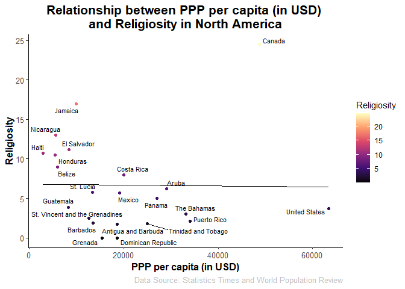<!-- -->

North America is the first sample that showed negative relationship. The
strength might look small. However, two respective places seem to have
an impact on the strength as outliers. If removed, the relationshp would
look more negative.

### South America

``` r
# Subset the dataframe to include only South America data
df_southa <- subset(df, Region == "South America")

ggplot(df_southa, aes(x = PPP, y = Religiosity, color = Religiosity)) +
  geom_point() +
  labs(x = "PPP per capita (in USD)", y = "Religiosity", title = "Relationship between PPP per capita (in USD) \nand Religiosity in South America", caption = "Data Source: Statistics Times and World Population Review") +
  scale_color_viridis_c(option = "magma") +
  geom_text_repel(aes(label = ifelse(!is.na(Country), Country, "")), size = 3, color = "black", show.legend = FALSE) +
  geom_smooth(method = "lm", se = FALSE, color = "black", linewidth = 0.5) +
  theme_classic() +
  theme(
    plot.title = element_text(size = 16, face = "bold", hjust = 0.5),
    axis.title = element_text(size = 12, face = "bold"),
    axis.text = element_text(size = 10),
    plot.caption = element_text(size = 10, color = "gray"))
```

    ## `geom_smooth()` using formula = 'y ~ x'

<!-- -->

Unlike North America, PPP and religiosity of South American countries is
positively correlated.

### The general relationship regarding regional differences

``` r
ggplot(df, aes(x = PPP, y = Religiosity, color = Region)) +
  geom_point(size = 3) +
  labs(x = "PPP per capita (in USD)", y = "Religiosity", title = "Relationship between Religiosity and Fertility", caption = "Data Source: Statistics Times and World Population Review") +
  scale_color_manual(values = c("red", "blue", "green", "purple", "orange", "#FFD700")) +
  geom_smooth(method = "lm", se = FALSE, aes(group = Region, color = Region)) +
  theme_minimal() +
  theme(
    plot.title = element_text(size = 16, face = "bold", hjust = 0.5, lineheight = 1.2),
    axis.title = element_text(size = 12, face = "bold"),
    axis.text = element_text(size = 10),
    legend.position = "bottom")
```

    ## `geom_smooth()` using formula = 'y ~ x'

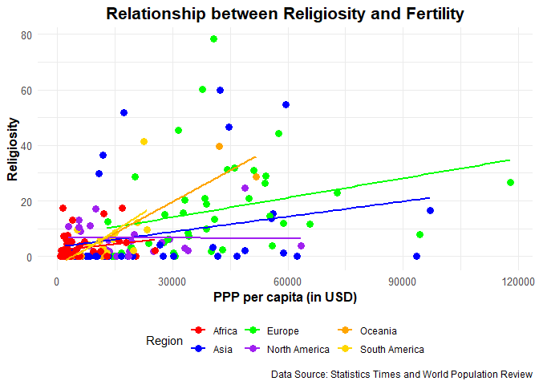<!-- -->

Again, hypothesis 3, relatively financially comfortable countries would
show low religiosity, is rejected except for North America. Although the
spread of plots is expanding, the relationship between PPP and
religiosity looks quite positive. The region, again, seemed to have
effect on the differences in the strength of correlation. The
interesting finding is that North America is the only group that showed
different patterns compared to other groups. The reason for such
phenomenon is not conclusive.

## Additional analysis

### Box plot 1: Fertility difference by Regions

``` r
# Subset the data to only include the columns we need
df2 <- subset(df, select = c("Region", "Fertility"))

# Create the box plot
# Define the color palette for each region
region_colors <- c("Africa" = "red", "Asia" = "blue", "Europe" = "green", "North America" = "purple", "Oceania" = "orange", "South America" = "yellow")

# Create the box plot with customizations
ggplot(df2, aes(x = Region, y = Fertility, fill = Region)) +
  geom_boxplot(color = "black") +
  labs(x = "Region", y = "Fertility Rate", 
       title = "Box Plot of Fertility Rate by Region", caption = "Data Source: Statistics Times and World Population Review") +
  theme_bw() +
  theme(plot.title = element_text(size = 18, face = "bold"),
        axis.text = element_text(size = 12),
        axis.title = element_text(size = 14),
        panel.grid.major = element_blank(),
        panel.grid.minor = element_blank(),
        legend.position = "none") +
  scale_fill_manual(values = region_colors) +
  scale_color_manual(values = region_colors)
```

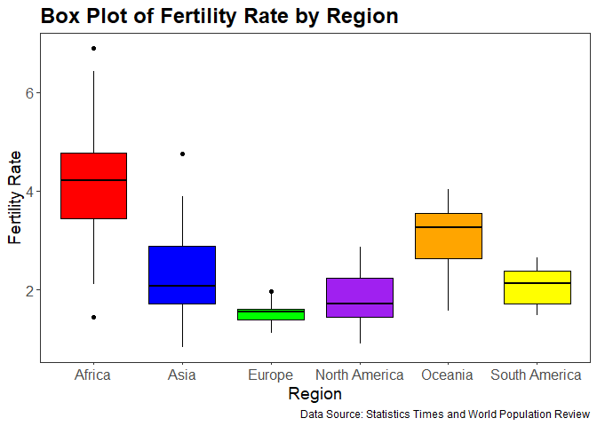<!-- -->

When compared the fertility rates only by different regions, African
countries showed considerably greater mean rate than the others. And
Europe showed least mean rate and IQR.

## Box plot 2: Religiosity difference by Region

``` r
# Subset the data to only include the columns we need
df3 <- subset(df, select = c("Region", "Religiosity"))

# Create the box plot
# Define the color palette for each region
region_colors <- c("Africa" = "red", "Asia" = "blue", "Europe" = "green", "North America" = "purple", "Oceania" = "orange", "South America" = "yellow")

# Create the box plot with customizations
ggplot(df3, aes(x = Region, y = Religiosity, fill = Region)) +
  geom_boxplot(color = "black") +
  labs(x = "Region", y = "Religiosity", 
       title = "Box Plot of Religiosity by Region", caption = "Data Source: Statistics Times and World Population Review") +
  theme_bw() +
  theme(plot.title = element_text(size = 18, face = "bold"),
        axis.text = element_text(size = 12),
        axis.title = element_text(size = 14),
        panel.grid.major = element_blank(),
        panel.grid.minor = element_blank(),
        legend.position = "none") +
  scale_fill_manual(values = region_colors) +
  scale_color_manual(values = region_colors)
```

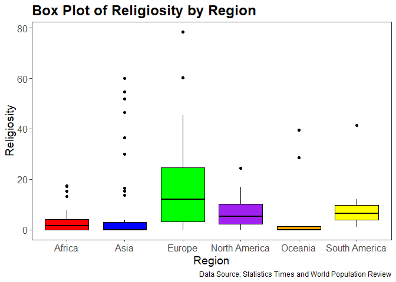<!-- -->

Another box plot was generated to compare the religiosity by region.
Although Asia displayed number of outliers, the five regions except
Europe showed similar level of religiosity. Europe showed greatest IQR.
Yet, Europe showed the least fertility rate considering its greater
average religiosity compared to the others.

### Additional scatter plot 1 : Relationship between PPP per capita, Religiosity and Fertlity rate

``` r
ggplot(df, aes(x = PPP, y = Religiosity, color = Fertility)) +
  geom_point(size = 3) +
  scale_x_continuous(labels = scales::comma, name = "PPP per capita (in USD)") +
  scale_y_continuous(name = "Religiosity") +
  scale_color_gradient(low = "skyblue", high = "red", limits = c(1, 8),
                       breaks = c(1, 2, 3, 4, 5, 6, 7, 8), 
                       guide = guide_colorbar(title = "Fertility Rate")) +
  labs(title = "Relationship between PPP, Religiosity, and Fertility",
       caption = "Data source: Statistics Times and World Population Review") +
  theme_bw() +
  theme(plot.title = element_text(size = 18, face = "bold"),
        axis.title = element_text(size = 14),
        axis.text = element_text(size = 12),
        legend.text = element_text(size = 12),
        legend.position = "right",
        panel.grid.major = element_blank(),
        panel.grid.minor = element_blank())
```

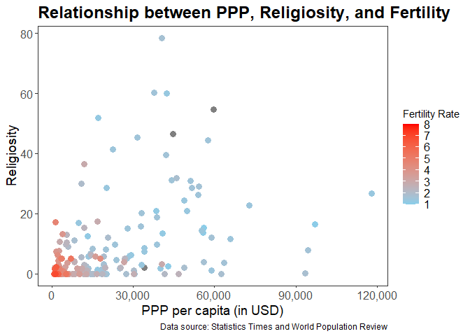<!-- -->

This plot clearly shows that there is a dense cluster at low religiosity
and low PPP. Both GDP and PPP are strongly associated with education
level and access to health medical services. The scatter plots suggest
an environment that would provide less SES and no strong belief to
organised religions is more likely to result greater fertility rate.

## Counclusion

The first hypothesis, PPP per capita would be negatively correlated with
fertility rate was not denied. However, the other two hypotheses,
assumed positive relationship between religiosity and fertility rate and
negative one between PPP per capita and religiosity, were rejected.
Interestingly, countries with greater PPP per capita rather demonstrated
deeper religiosity. Although possible effect of region as a covariate on
these relationship was questioned, the effect seemed not big enough to
change the direction of correlations except the strenght of association.
However, there was interesting pattern found in North America as they
showed more accepting those two rejected hypotheses. Further research is
recommended to find out what is causing this different findings from the
past research.

# References

Least Religious Countries 2023. (2023). World Population Review.
<https://worldpopulationreview.com/country-rankings/least-religious-countries>

List of Countries by GDP (PPP) per capita. (2021, Jun 21). Statistics
Times.https://statisticstimes.com/economy/countries-by-gdp-capita-ppp.php

Rowthorn, R. (2011). Religion, fertility and genes: a dual inheritance
model. Proceedings of the Royal Society B: Biological Sciences,
278(1717), 2519-2527.

Storm, I. (2017). Does economic insecurity predict religiosity? Evidence
from the European social survey 2002–2014. Sociology of Religion, 78(2),
146-172.

Vandenbroucke, G. (2016). The link between fertility and income. Federal
Reserve Bank of, St Louis, USA. Dec, 13.
